# Work_with_Keyence_PLC
# Cách cấu hình PLC để có thể nhận tín hiệu cảm biến với python


# Mục lục

[I. Cài đặt Kv studio](#i-cài-đặt-kv-studio)
- [1. Chạy file setup](#1-chạy-file-setup)
- [2. Chạy file cập nhật](#2-chạy-file-cập-nhật)

[II. Cách sử dụng](#ii-cách-sử-dụng)
- [1. Kết nối PLC với Kv studio](#1-Kết-nối-PLC-với-Kv-studio)
  - [1. Kết nối bằng cáp USB-A](#1-Kết-nối-bằng-cáp-usb---a)
  - [2. Kết nối bằng ethernet](#2-Kết-nối-bằng-ethernet)
  - [3. Lập trình PLC](#3-Lập-trình-PLC)
- [2. Kết nối PLC với python thông qua MC protocol](#2-Kết-nối-PLC-với-python-thông-qua-MC-protocol)

[III. Ví dụ](#iii-Ví-dụ)


# I. Cài đặt Kv studio

## 1. Chạy file setup

Để cài đặt phần mềm `kv-studio` ta cần có file setup từ nhà cung cấp.  
Đầu tiên vào thư mục [kv_studio_setup](./kv_studio_setup/setup.exe) để tải `file setup`về và cài đặt  

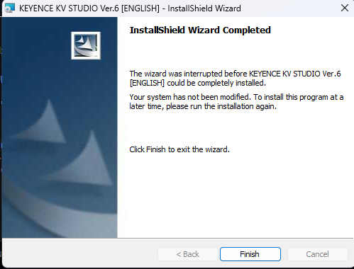

## 2. Chạy file cập nhật

Sau khi đã chạy file setup thì vào thư mục [kv_studio_update_v11](./kv_studio_setup/KVS_Update_G_1167.zip) `tải về toàn bộ file zip`, giải nén và chạy file cập nhật lên phiên bản `kv studio version 11.6` hoặc có thể sử dụng [kv_studio_update_v6](./kv_studio_setup/KV%20STUDIO%20Ver.6E.msi) để cập nhật `kv studio version 6.1`  

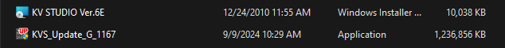

# II. Cách sử dụng

## 1. Kết nối PLC với Kv studio

Đây là bộ PLC demo, bao gồm **Nguồn 24V, PLC kv-7500, Kv-C32XC, Kv-C32TC**, cổng ethernet sẽ hoạt động nếu khi cắm ethernet mà nó vẫn sáng 2 đèn, nếu không là cổng ethernet có vấn đề.  

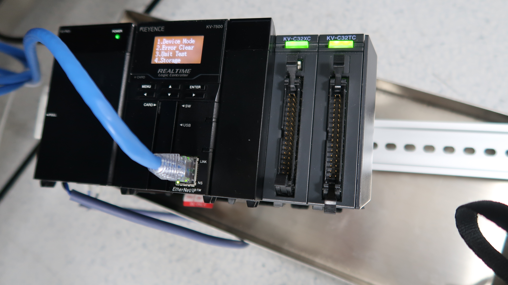

### 1. Kết nối bằng cáp USB-A

Kết nối PLC với phần mềm `Kv Studio` có thể dùng cáp **USB-A**, đây cũng là phương pháp nhanh và tối ưu nhất.  

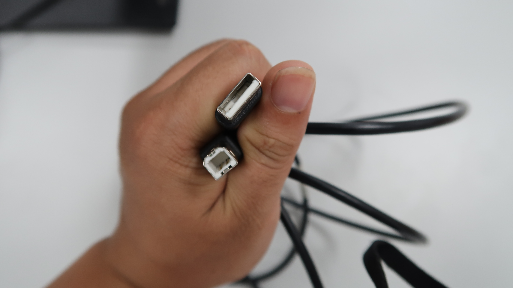

Cắm 1 đầu USA vào PLC và đầu còn lại cắm vào máy tính  

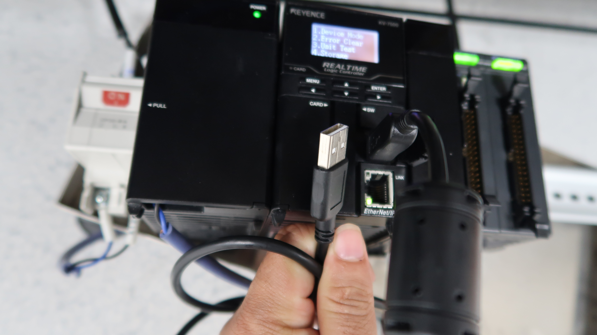

Sau đó mở phần mềm **Kv-Studio**  

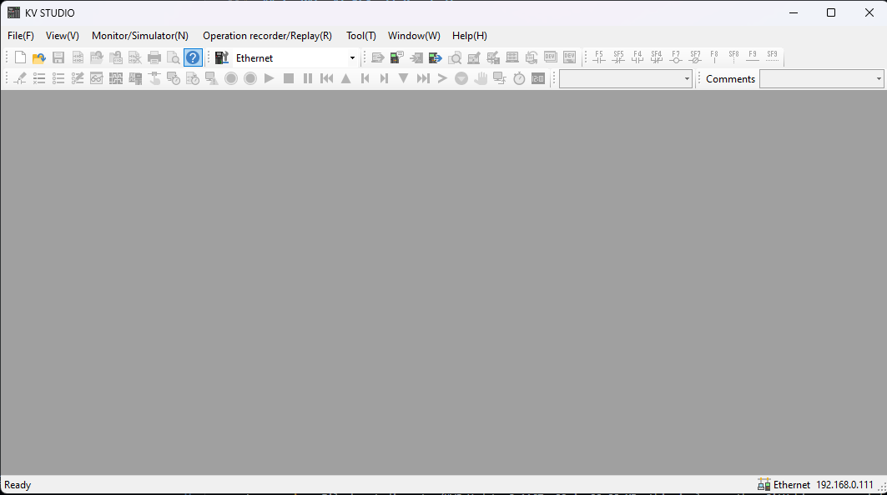

Chọn phương thức kết nối là **USB** và nhấn **Ctrl + F5** hoặc biểu tượng như bên dưới  

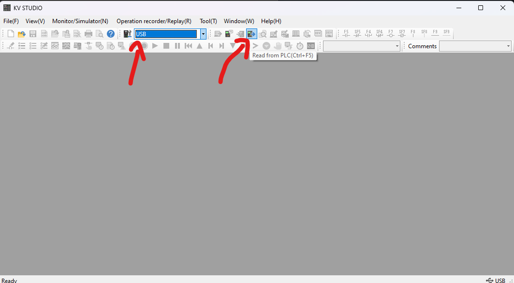

### 2. Kết nối bằng ethernet

Còn một cách kết nối khác là sử dụng ethernet. Một đầu ethernet sẽ cắm vào cổng ethernet nằm trên PLC, đầu ethernet còn lại cắm vào switch (dành cho nhiều thiết bị, thì các thiết bị cắm vào switch, và 1 đầu máy tính cắm vào switch) hoặc cắm trực tiếp vào máy tính.  

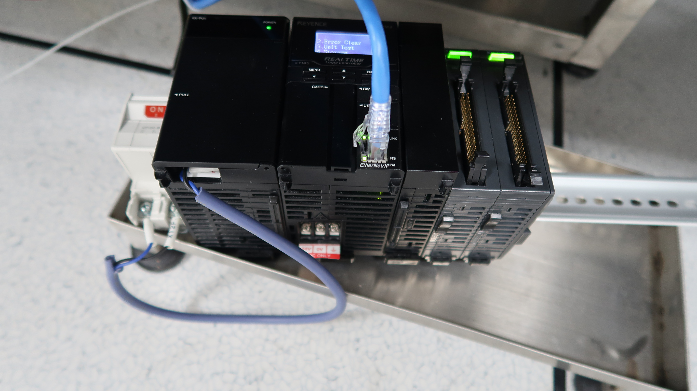

Sau khi cắm xong thì cũng vào phần mềm kv studio và chọn phương thức kết nối là `ethernet` xong chọn `Read from PLC`  

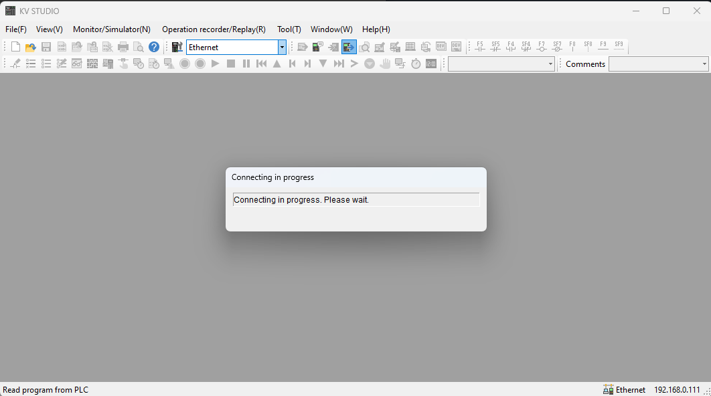

Sau đó nó sẽ hiển thị bảng lựa chọn thì ấn vào `Select all(S)` và chọn `Excute(E)` để kết nối với PLC  

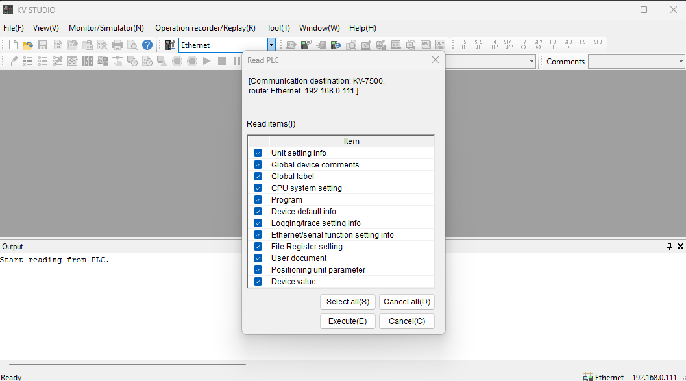

Đợi một lúc để tải các thông số từ PLC lên phần mềm, sau một lúc thì đây sẽ là giao diện nếu kết nối thành công, PLC này đã nạp chương trình nên khi tải thì nó sẽ tải luôn chương trình trong PLC, ví dụ đoạn code trong ảnh:  

## Có 1 lưu ý ở đây, với code PLC, ta không thể lấy trực tiếp giá trị `X3400` mà ta sẽ lấy nó thông qua `M1000`, hiện tại mình chưa biết lỗi này do đâu, và cách xử lý như nào. Vì vậy cần phải thử các giá trị có thể đọc được từ code PLC.  

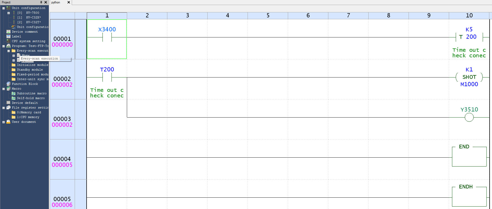

Ta có thể thấy phía bảng bên trái sẽ là các thiết bị đang kết nối với PLC, Bộ PLC của tôi sẽ có hai khối mở rộng là Kv-C32XC, Kv-C32TC nên nó đang hiển thị đúng, và nếu nó hiển thị đúng thì các khối mở rộng và PLC sẽ có màu xanh , program: sẽ là các đoạn code PLC  

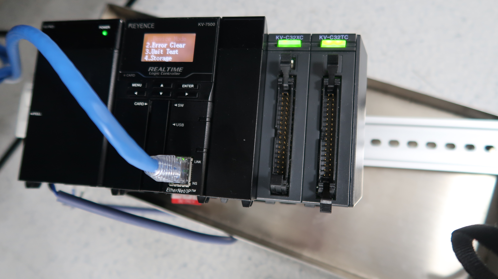

Nếu PLC không hiển thị đúng với những thiết bị đang kết nối, thì các màu sắc sẽ là màu đỏ, và khi đó ta cần cấu hình cho nó kết nối khớp. Để PLC có thể nhận diện được các khối mở rộng thì ta vào chế độ `Editor` và click vào `Kv-7500`

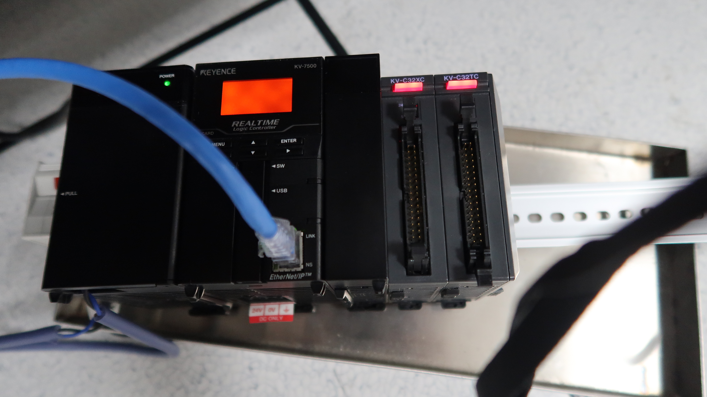

Điều này có nghĩa là bộ PLC của chúng ta có 1 PLC và 2 khối mở rộng, nhưng phần mềm lại không nhận diện được, nên sẽ xảy ra lỗi  

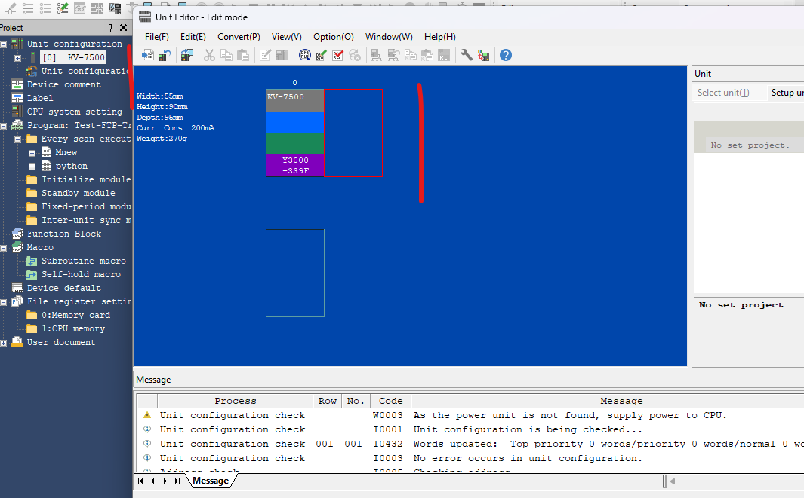  

Để sửa lỗi này thì ta quay lại chế độ **Editor** và nhấn vào tên bộ PLC ở mục `Unit configuration`  

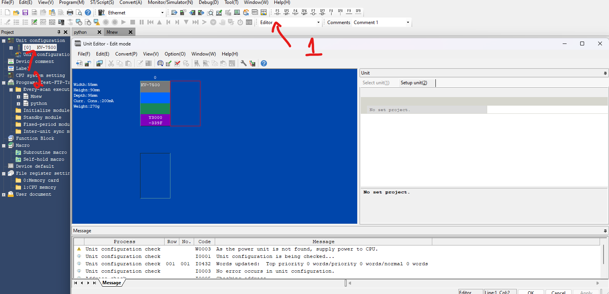

Từ bảng **unit editor** ta bấm vào **select unit** và chọn các thiết bị mà bạn đang kết nối với PLC:  

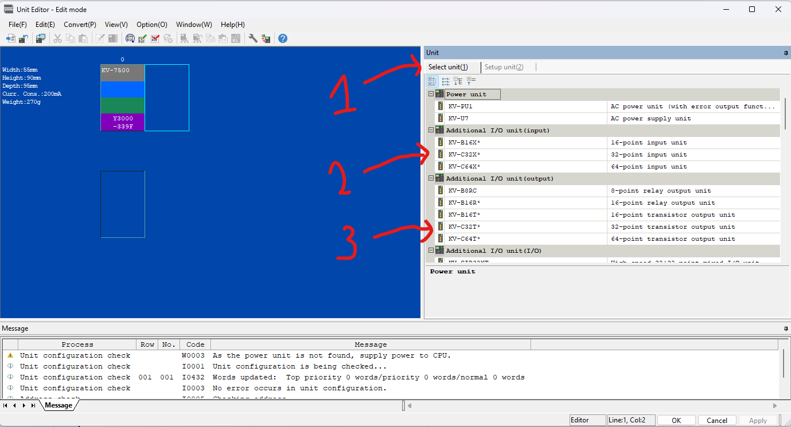

Đây sẽ là kết quả cuối cùng, mình có `PLC kv-7500` tiếp theo kết nối đến `Kv-C32XC`, tiếp theo kết nối đến `Kv-C32TC` thì cũng phải chọn thiết bị mở rộng tương ứng. Và ấn `apply` sau đó chọn `OK`.    

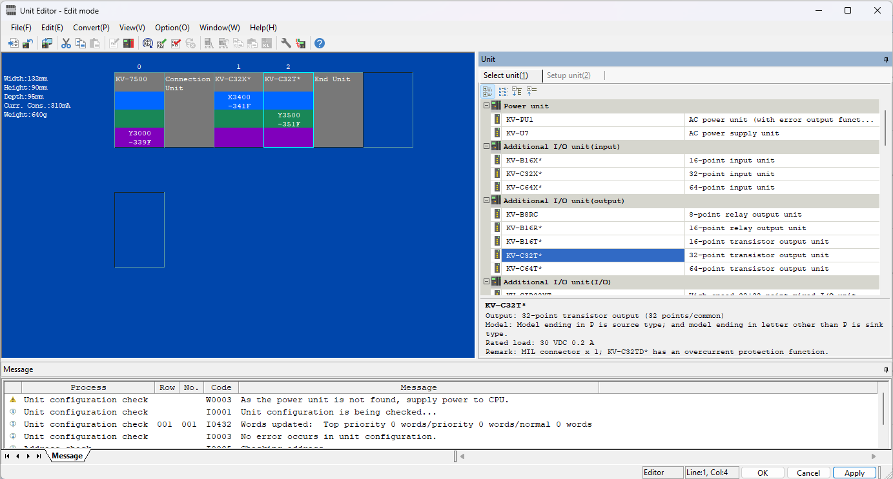

Bước cuối cùng là nạp chương trình này vào PLC để PLC ghi nhớ bằng cách nhấn ** Transfer to PLC**  
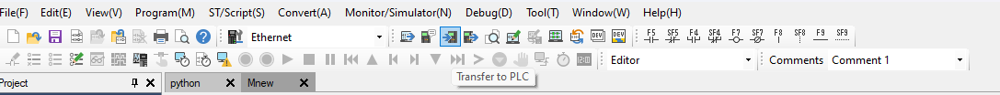

Khi nạp chương trình vào PLC thì nó sẽ thông báo nhưu hình dưới, chọn `Select all(S)` và ấn `Exxcute(E)` để nạp:  

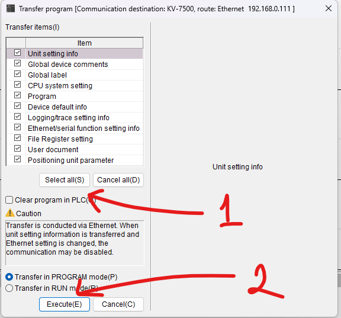

Lưu ý: Nếu trong PLC đã có chương trình code, thì phải quan sát xem code đó có dòng nào màu đỏ không, nếu nó màu đỏ tức là chương trình đang lỗi, nên nạp code vào plc sẽ không chấp nhận, vì vậy hãy sửa code cho đúng hoặc xóa file code đi rồi nạp chương trình vào plc


## 2. Kết nối PLC với python thông qua MC protocol

Để kết nối PLC với máy tính bằng python thì ta cần biết được `IP của PLC`, có 2 cách để xem IP. Cách một như đã nói bước 1, mở chế độ `CPU monitor` và chọn `ethernet` để xem IP. Còn cách 2 là dùng phần mềm KV studio, cách này sẽ tiện hơn và mình có thể chỉnh sửa IP sau cho trùng với IP trên máy tính, để nó có thể liên lạc với nhau.  


Từ đây, ta có thể biết được ip của PLC và có thể tùy ý chỉnh sửa `IP` hay `Subnet Mask` để phù hợp với PC  
Ở đây ta cần có các thông tin sau để kết nối PLC bằng phương pháp `MC protocol`:  

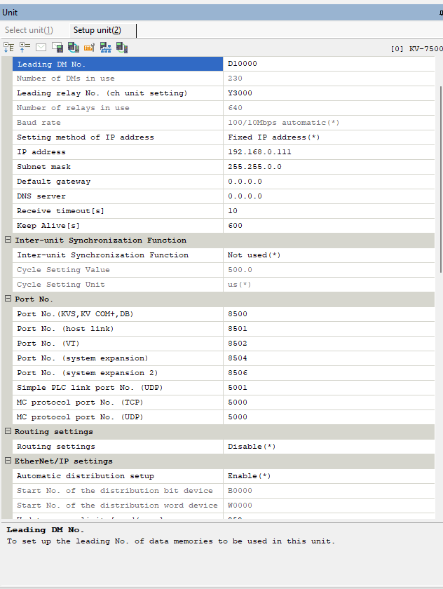

IP PLC: `192.168.0.111`, subnet mask: `255.255.0.0`, defaut gateway: `0.0.0.0`  
MC protocol port(TCP): `5000`

Vậy là đã đủ yêu cầu về PLC, tiếp theo là `python`, ta cần cài đặt thư viện `mc protocol` của Mitsubisi [tại đây](https://github.com/senrust/pymcprotocol) hoặc sử dụng câu lệnh pip:  
```python

pip install pymcprotocol

```
Cách kết nối bằng python như sau:  
```python

import pymcprotocol  #pip install pymcprotocol

# Địa chỉ IP của PLC KV-7500 và cổng TCP
PLC_IP = "192.168.0.111"  
PLC_PORT = 5000  

# Địa chỉ chứa giá trị cần đọc trên PLC Keyence trong KV-studio
SENSOR_ADDRESS = "M1000"  

# Biến lưu trữ trạng thái trước đó của cảm biến (giả sử bắt đầu là OFF)
previous_state = 0

# Khởi tạo kết nối MC Protocol
mc = pymcprotocol.Type3E()

# Kết nối tới PLC
mc.connect(PLC_IP, PLC_PORT)
print("Đã kết nối tới PLC")

```

Nếu nó in ra dòng `Đã kết nối tới PLC` thì có nghĩa là đã kết nối thành công với PLC và ta tiến hành đọc dữ liệu từ các thanh ghi của PLC.  
# III. Ví dụ

Xem ví dụ cụ thể [Tại đây](Example/get_data_from_plc.py)