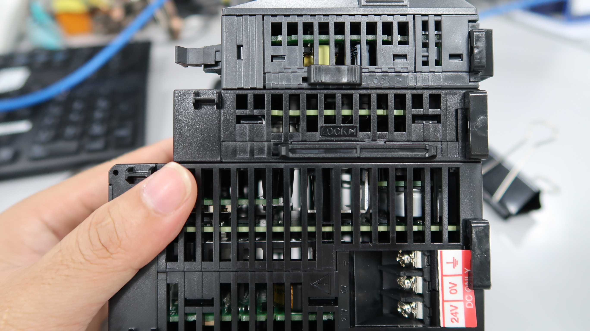
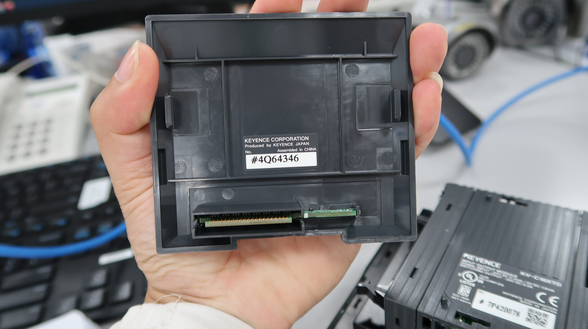
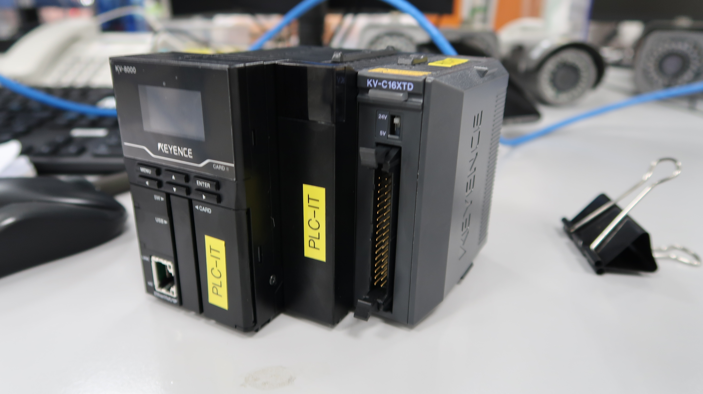
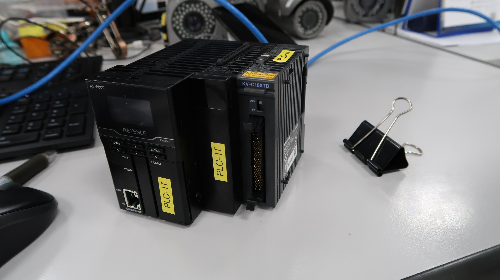
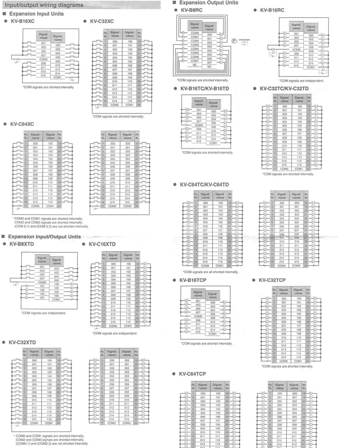
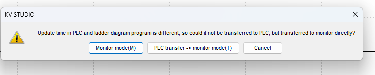
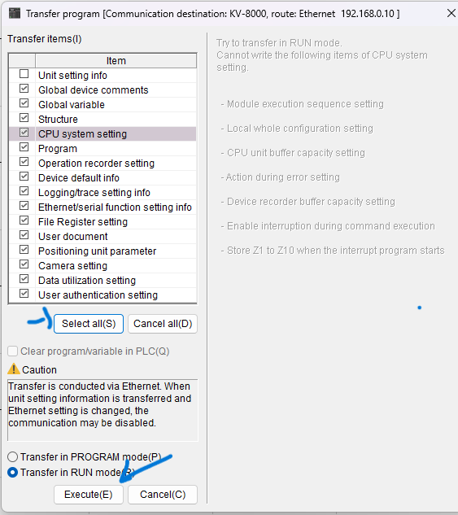
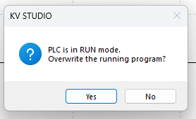
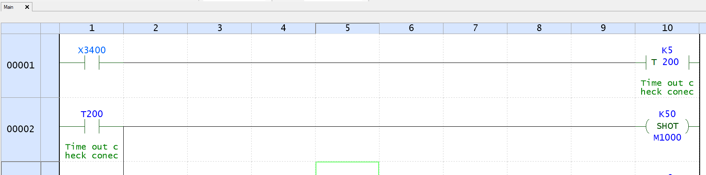
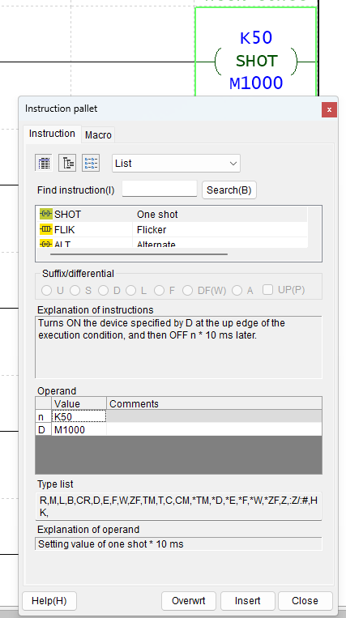

# Work_with_Keyence_PLC
# Cách cấu hình PLC để có thể nhận tín hiệu cảm biến với python


# Mục lục

[I. Cài đặt Kv studio](#i-cài-đặt-kv-studio)
- [1. Chạy file setup](#1-chạy-file-setup)
- [2. Chạy file cập nhật](#2-chạy-file-cập-nhật)

[II. Cách sử dụng](#ii-cách-sử-dụng)
- [1. Kết nối PLC với Kv studio](#1-Kết-nối-PLC-với-Kv-studio)
  - [1. Kết nối bằng cáp USB-A](#1-Kết-nối-bằng-cáp-usb---a)
  - [2. Kết nối bằng ethernet](#2-Kết-nối-bằng-ethernet)
  - [3. Lập trình PLC](#3-Lập-trình-PLC)
- [2. Kết nối PLC với python thông qua MC protocol](#2-Kết-nối-PLC-với-python-thông-qua-MC-protocol)

[III. Đọc ghi dữ liệu PLC](#iii-đọc-ghi-dữ-liệu-plc)

- [1. Kết nối cảm biến PR-G51N với PLC](#1-kết-nối-cảm-biến-pr-g51n-với-plc)
  - [1. Cấp nguồn cho PLC](#1-cấp-nguồn-cho-plc)
  - [2. Cấp nguồn cho XC-T34B2](#2-cấp-nguồn-cho-xc-t34b2)
  - [3. Kết nối cảm biến PRG1N với XC-T34B2](#3-kết-nối-cảm-biến-pr-g51n-với-xc-t34b2)
  - [4. Viết chương trình với KV Studio](#4-viết-chương-trình-với-kv-studio)
  - [5. Đọc tín hiệu với Python](#5-đọc-tín-hiệu-với-python)

[IV. Vi dụ](#iv-ví-dụ)

# I. Cài đặt Kv studio

## 1. Chạy file setup

Để cài đặt phần mềm `kv-studio` ta cần có file setup từ nhà cung cấp.  
Đầu tiên vào thư mục [kv_studio_setup](./kv_studio_setup/setup.exe) để tải `file setup`về và cài đặt  


## 2. Chạy file cập nhật

Sau khi đã chạy file setup thì vào thư mục [kv_studio_update_v11](./kv_studio_setup/KVS_Update_G_1167.zip) `tải về toàn bộ file zip`, giải nén và chạy file cập nhật lên phiên bản `kv studio version 11.6` hoặc có thể sử dụng [kv_studio_update_v6](./kv_studio_setup/KV%20STUDIO%20Ver.6E.msi) để cập nhật `kv studio version 6.1`  


# II. Cách sử dụng

## 1. Kết nối PLC với Kv studio

Đây là bộ PLC demo, bao gồm **Nguồn 24V, PLC kv-7500, Kv-C32XC, Kv-C32TC**, cổng ethernet sẽ hoạt động nếu khi cắm ethernet mà nó vẫn sáng 2 đèn, nếu không là cổng ethernet có vấn đề.  


### 1. Kết nối bằng cáp USB-A

Kết nối PLC với phần mềm `Kv Studio` có thể dùng cáp **USB-A**, đây cũng là phương pháp nhanh và tối ưu nhất.  


Cắm 1 đầu USA vào PLC và đầu còn lại cắm vào máy tính  


Sau đó mở phần mềm **Kv-Studio**  


Chọn phương thức kết nối là **USB** và nhấn **Ctrl + F5** hoặc biểu tượng như bên dưới  


Nếu gặp lỗi `No valid program in PLC. Stop reading` như hình bên dưới thì xử lý như sau:  


Có nghãi là PLC của bạn chưa có chương trình nào cả. Vì thế ta cần 1 chương trình mới cho PLC. Chọn `File --> New projetc`  


Sau đó chọn `PLC model` sao cho đúng với model của bạn. Như mình sử dụng `PLC kv800` thì chọn `KV-8000`, điền tên project và ấn `OK`.  


Tiếp theo nhấn `Yes` và nhấn `Yes` cho đến khi hiện bảng sau:  


thì đóng nó lại và tiến hành chuyển chương trình trống này cho PLC bằng lệnh `Ctr + F8`  


Sau đó ấn OK để tiếp tục

### 2. Kết nối bằng ethernet

Còn một cách kết nối khác là sử dụng ethernet. Một đầu ethernet sẽ cắm vào cổng ethernet nằm trên PLC, đầu ethernet còn lại cắm vào switch (dành cho nhiều thiết bị, thì các thiết bị cắm vào switch, và 1 đầu máy tính cắm vào switch) hoặc cắm trực tiếp vào máy tính.  


Sau khi cắm xong thì cũng vào phần mềm kv studio và chọn phương thức kết nối là `ethernet` xong chọn `Read from PLC`  


Sau đó nó sẽ hiển thị bảng lựa chọn thì ấn vào `Select all(S)` và chọn `Excute(E)` để kết nối với PLC  


Đợi một lúc để tải các thông số từ PLC lên phần mềm, sau một lúc thì đây sẽ là giao diện nếu kết nối thành công, PLC này đã nạp chương trình nên khi tải thì nó sẽ tải luôn chương trình trong PLC, ví dụ đoạn code trong ảnh:  

## Có 1 lưu ý ở đây, với code PLC, ta không thể lấy trực tiếp giá trị `X3400` mà ta sẽ lấy nó thông qua `M1000`, hiện tại mình chưa biết lỗi này do đâu, và cách xử lý như nào. Vì vậy cần phải thử các giá trị có thể đọc được từ code PLC.  


Ta có thể thấy phía bảng bên trái sẽ là các thiết bị đang kết nối với PLC, Bộ PLC của tôi sẽ có hai khối mở rộng là Kv-C32XC, Kv-C32TC nên nó đang hiển thị đúng, và nếu nó hiển thị đúng thì các khối mở rộng và PLC sẽ có màu xanh , program: sẽ là các đoạn code PLC  


Nếu PLC không hiển thị đúng với những thiết bị đang kết nối, thì các màu sắc sẽ là màu đỏ, và khi đó ta cần cấu hình cho nó kết nối khớp. Để PLC có thể nhận diện được các khối mở rộng thì ta vào chế độ `Editor` và click vào `Kv-7500`


Điều này có nghĩa là bộ PLC của chúng ta có 1 PLC và 2 khối mở rộng, nhưng phần mềm lại không nhận diện được, nên sẽ xảy ra lỗi  

  

Để sửa lỗi này thì ta quay lại chế độ **Editor** và nhấn vào tên bộ PLC ở mục `Unit configuration`  


Từ bảng **unit editor** ta bấm vào **select unit** và chọn các thiết bị mà bạn đang kết nối với PLC:  


Đây sẽ là kết quả cuối cùng, mình có `PLC kv-7500` tiếp theo kết nối đến `Kv-C32XC`, tiếp theo kết nối đến `Kv-C32TC` thì cũng phải chọn thiết bị mở rộng tương ứng. Và ấn `apply` sau đó chọn `OK`.    


Bước cuối cùng là nạp chương trình này vào PLC để PLC ghi nhớ bằng cách nhấn ** Transfer to PLC**  


Khi nạp chương trình vào PLC thì nó sẽ thông báo nhưu hình dưới, chọn `Select all(S)` và ấn `Exxcute(E)` để nạp:  


Lưu ý: Nếu trong PLC đã có chương trình code, thì phải quan sát xem code đó có dòng nào màu đỏ không, nếu nó màu đỏ tức là chương trình đang lỗi, nên nạp code vào plc sẽ không chấp nhận, vì vậy hãy sửa code cho đúng hoặc xóa file code đi rồi nạp chương trình vào plc


## 2. Kết nối PLC với python thông qua MC protocol

Để kết nối PLC với máy tính bằng python thì ta cần biết được `IP của PLC`, có 2 cách để xem IP. Cách một như đã nói bước 1, mở chế độ `CPU monitor` và chọn `ethernet` để xem IP. Còn cách 2 là dùng phần mềm KV studio, cách này sẽ tiện hơn và mình có thể chỉnh sửa IP sau cho trùng với IP trên máy tính, để nó có thể liên lạc với nhau.  


Từ đây, ta có thể biết được ip của PLC và có thể tùy ý chỉnh sửa `IP` hay `Subnet Mask` để phù hợp với PC  
Ở đây ta cần có các thông tin sau để kết nối PLC bằng phương pháp `MC protocol`:  


IP PLC: `192.168.0.111`, subnet mask: `255.255.0.0`, defaut gateway: `0.0.0.0`  
MC protocol port(TCP): `5000`

Vậy là đã đủ yêu cầu về PLC, tiếp theo là `python`, ta cần cài đặt thư viện `mc protocol` của Mitsubisi [tại đây](https://github.com/senrust/pymcprotocol) hoặc sử dụng câu lệnh pip:  
```python

pip install pymcprotocol

```
Cách kết nối bằng python như sau:  
```python

import pymcprotocol  #pip install pymcprotocol

# Địa chỉ IP của PLC KV-7500 và cổng TCP
PLC_IP = "192.168.0.111"  
PLC_PORT = 5000  

# Địa chỉ chứa giá trị cần đọc trên PLC Keyence trong KV-studio
SENSOR_ADDRESS = "M1000"  

# Biến lưu trữ trạng thái trước đó của cảm biến (giả sử bắt đầu là OFF)
previous_state = 0

# Khởi tạo kết nối MC Protocol
mc = pymcprotocol.Type3E()

# Kết nối tới PLC
mc.connect(PLC_IP, PLC_PORT)
print("Đã kết nối tới PLC")

```

Nếu nó in ra dòng `Đã kết nối tới PLC` thì có nghĩa là đã kết nối thành công với PLC và ta tiến hành đọc dữ liệu từ các thanh ghi của PLC.  

# III. Đọc ghi dữ liệu PLC

## 1. Kết nối cảm biến PR-G51N với PLC

### 1. Cấp nguồn cho PLC

Mình sẽ sử dụng nguồn `MS2-H100` để cấp nguồn cho PLC `KV-8000`, bộ ghép nối dùng để đọc và truyền tín hiệu cho cảm biến, đèn, chuông, ... sẽ là `KV-C16XTD`. Để có thể kết nối PLC `KV-8000` với `KV-C16XTD` thì ta cần bộ trung gian `KV-7000C`. Các thiết bị ngoại vi như cảm biến, đèn hay chuông thì sẽ cần đấu nối thông qua `XC-T34B2`.  


Hình ảnh phía trên là toàn bộ các `unit` mà chúng ta cần.  

Đầu tiên là nguồn, ta chỉ cần cung cấp cho PLC là nguồn `24V DC` là được, các thiết bị chuyển mạch đáp ứng đầu ra `24V DC` mà ổn định đều có thể thay thế được.  


Đây mình sẽ sử dụng nguồn của `Keyence` để đồng bộ các thiết bị tốt nhất có thể. Các bạn cần đi dây như hình ảnh phía trên, bao gồm 2 cực của nguồn xoay chiều và một dây nối đất. Còn lại đầu ra phía trên sẽ là `24V DC` mà chúng ta cần.  


Chúng ta thấy đầu ra có kí hiệu `cực âm` và `cực dương` ở trên nguồn, ta tiến hành nối dây điện vào nó.  


Và nối phần còn lại vào nguồn PLC sao cho đúng với `cực âm` và `cực dương` của PLC.  


Kết quả sẽ là như hình bên dưới:  


Chúng ta cần ghép nối các `unit` lại với nhau bằng cách cắm các chân của unit ở phía bên cạnh vào với nhau như hình bên dưới.  


Sau đó đẩy chốt khóa theo hướng chỉ định để `lock` các chi tiết lại với nhau cho chắc chắn.  



Tuy nhiên để hoàn chỉnh một bộ thì chúng ta cũng cần khối `end unit`, để cho chương trình biết chúng ta đã hoàn thành ghép nối các phần lại với nhau. `End unit` có hình dạng của 1 cái nắp đóng có phần kết nối cuối cùng như hình sau:  



Hoàn tất 1 bộ sẽ có cấu trúc như sau: Nguồn --> bộ điều khiển lập trình (KV-8000) --> khối trung gian (KV-7000C, còn các đời thấp hơn như KV-5000, KV-3000 thì không cần khối này) --> các unit cần thiết (bộ nhận tín hiệu, bộ truyền tín hiệu, bộ kết nối ethernet dành cho các thiết bị không có cổng ethernet, ...) --> end unit  



Nếu lắp thiếu `end unit` như hình bên dưới đây thì chương trình sẽ không hoạt động được cũng như không thể kết nối tới `KV-studio`.  



### 2. Cấp nguồn cho XC-T34B2

Đây là sơ đồ kết nối của `XC-T34B2` với mỗi thiết bị `input/output` như sau:  



Tham khảo chi tiết [tại đây](Document/XCT34B2.pdf). Vì mỗi thiết bị sẽ có 1 cách kết nối với `XC-T34B2` nên cần xem sơ đồ trước.  

Nguồn của `XC-T34B2` nằm ở 2 chân 17 và 34. Chân 17 sẽ là `dương 24V DC`, chân 34 sẽ là `âm 24V DC`. Ta nối dây vào 2 chân đó.  


Hai đầu dây còn lại nối vào nguồn `24V DC` từ cục nguồn `MS2-H100` hoặc từ chân `PLC` cũng được.  


Kết quả ta được như sau:  


Thứ tự đấu dây cho các thiết bị với `XC-T34B2` như sau:  
Với mỗi thiết bị kết nối trực tiếp với `XC-T34B2` sẽ có cách đấu riêng. Với mình đang sử dụng `KV-C16XTD` để kết nối trực tiếp tới `XC-T34B2` nên nó sẽ có cấu trúc như sau:  


> Chân 17 là chân nguồn cực dương  
> Chân 34 là chân nguồn cực âm  
> Chân 1 đến 16 sẽ dành cho các dây tín hiệu input. Có nghĩa là các thiết bị truyền tín hiệu vào PLC sẽ cắm ở những chân này, ví dụ như cảm biến (truyền tín hiệu cho PLC khi có vật cản), ...  
> Chân 18 đến 33 sẽ dành cho các dây tín hiệu output. Có nghĩa là các thiết bị nhận tín hiệu từ PLC sẽ cắm ở đây, ví dụ như chuông (nhận tín hiệu từ PLC để kêu), đèn (nhận tín hiệu từ PLC để sáng hay đổi màu), ...  

Một số loại unit khác chỉ có chức năng `nhận tín hiệu` mà không thể truyền tín hiệu cho các thiết bị khác như đèn, chuông, không giống với `KV-C16XTD` vừa có thể `input` và `output` nên cấu trúc cắm dây vào `XC-T34B2` cũng không giống nhau.  

Để hoàn tất kết nối giữa `XC-T34B2` với `KV-C16XTD` thì ta cần cắm dây kết nối 2 thiết bị này lại với nhau bằng cáp `XC-H34-03` như hình bên dưới:  


` Tạm thời hãy bỏ qua 2 con rơ le, 2 con rơ le này dùng để điều khiển đèn 2 màu đỏ vs xanh, mình chưa tìm hiểu được cấu trúc kết nối của nó nên chưa viết tài liệu về nó`  

### 3. Kết nối cảm biến PR-G51N với XC-T34B2

Cảm biến quang `PR-G51N` sẽ là loại kim loại có 2 đầu, 1 đầu sẽ phát tín hiệu quang, đầu còn lại sẽ thu tín hiệu quang, và 2 đầu cũng sẽ có 1 đầu `4 dây` và 1 đầu `3 dây`.  


Trong 4 dây thì:  

> Dây nâu: Nối với cực dương  
> Dây xanh biển: Nối với cực âm  
> Dây đen: Tín hiệu 1  
> Dây trắng: Tín hiệu 2  

Ta ghép nối 2 dây nguồn cùng cực của cảm biến lại với nhau theo cặp: `cùng xanh - cùng nâu` như hình dưới:  


Sau đó cấp nguồn cho 2 cảm biến bằng nguồn `24V DC`. Nếu nối vào nguồn của `XC-T34B2` thì sẽ như sau: 

> Dây xanh nước biển - vào chân 34: tương ứng với cực âm  
> Dây nâu - vào chân 17: tương ứng với cực dương  


Hoặc cũng có thể nối trực tiếp vào nguồn 24V của `MS2-H100`.  Tiếp theo ta lấy `dây đen của cảm biến có 4 màu dây` nối vào chân số 1 của `XC-T34B2`.  


Các chân còn lại (dây trắng của cảm biến 4 dây và dây đen của cảm biến 3 dây) dán băng dính bọc các dây này để tránh trường hợp tạo tia lửa diện do va quệt.  

### 4. Viết chương trình với KV studio

Mở KV studio và vào chế độ `Editor` và mở bảng `Unit Editor` để quan sát chân địa chỉ đọc ghi dữ liệu như sau:  


Từ hình ảnh ở `Unit Editor` ta có thể có các thông tin. Nhìn vào `KV-C16XTD` có 2 chỉ số:  

> X3400: là địa chỉ bắt đầu cho việc đọc các tín hiệu input (từ chân 1 đến chân 16)  
> Y3410: là địa chỉ bắt đầu cho việc đọc các tín hiệu output (từ chân 18 đến chân 33)

Ở bước `kết nối dây tín hiệu cảm biến` ta đã nối dây tín hiệu vào `chân số 1` của `XC-T34B2` nên ở chương trình code, ta sẽ đọc nó với địa chỉ `X3400`, nếu ta nối dây vào `chân số 2` thì địa chỉ sẽ là `X3401`, ... tương tự với chân 16 thì sẽ có địa chỉ là `X3415`.  
Còn đối với các thiết bị output thì nếu ta nối vào `chân số 18` thì địa chỉ để đọc nó là `Y3410`, nối vào `chân số 19` thì địa chỉ để đọc nó là `Y3411`.  


Như chương trình PLC ở trên, mỗi khi có tín hiệu từ cảm biến thì `X3400` sẽ có tín hiệu, tín hiệu này đi qua một `Timer` có chức năng đếm, nó sẽ đếm nếu tín hiệu kéo dài `500 ms` thì `M1000` sẽ có tín hiệu.


Khi đó ta tiến hành đọc tín hiệu từ địa chỉ `M1000`. Chứ không phải từ `X3400`, mình không biết lý do tại sao ta ko đọc trực tiếp được từ `X3400` mà phải đọc thông qua địa chỉ `M1000`. Mình muốn tín hiệu qua `Timer` bởi vì mình muốn phải đủ `500ms` thì mới coi đó là tín hiệu, bởi vì có thể vô tình cái gì có thể bay qua cảm biến thì nó đọc luôn tín hiệu. Nó quá nhạy nên phải đếm đủ 500ms thì coi là tín hiệu.  

Nếu các bạn cần độ chính xác tuyệt đối thì thay `K5 T200` thành `M1000` luôn thì khi `X3400` có tín hiệu thì `M1000` cũng nhận luôn tín hiệu. Và xóa đi dòng thứ 2 là được.  

Để đưa chương trình vào PLC thì ta chỉ cần ấn 1 trong 2 nút `Transfer to PLC` để PLC `KV-8000` ghi nhớ mã này là được.  


Hoặc chuyển sang chế độ `monitor` để quan sát chương trình chạy.  


Sau đó ấn `PLC transfer --> monitor mode`để chuyển code vào PLC.  



Sau đó nó sẽ hiển thị hộp thoại như hình dưới:  



Nhớ chọn `Select all` và ấn `Execute` để chương trình nạp code.  



Nếu PLC của bạn đang ở chế độ `Run` thì nó sẽ hỏi có muốn ghi đè không, thì cứ việc ấn `Yes` và đợi nó nạp vào PLC là được.  
### 5. Đọc tín hiệu với Python  

Đầu tiên ta cần cài đặt thư viện `pymcprotocol` bằng câu lệnh sau:  

```python

pip install pymcprotocol
```
Hoặc tham khảo thông tin chi tiết thư viện tại [trang chủ](https://pypi.org/project/pymcprotocol/).  
Sau đó kết nối với PLC thông qua địa chỉ `IP và Port` tương tứng. Với PLC của mình có `IP: 192.168.0.111` và cổng mặc định của `MC protocol: 5000`.  

```python
import pymcprotocol  #pip install pymcprotocol

# Địa chỉ IP của PLC KV-8000 và cổng TCP
PLC_IP = "192.168.0.111"  
PLC_PORT = 5000  

# Khởi tạo kết nối MC Protocol
mc = pymcprotocol.Type3E()

# Kết nối tới PLC
mc.connect(PLC_IP, PLC_PORT)
print("Đã kết nối tới PLC") 
```

Sau đó ta muốn đọc giá trị nào thì cung cấp giá trị đó, ví dụ của mình là đọc giá trị `M1000`.  

```python
# Địa chỉ chứa giá trị cần đọc trên PLC Keyence trong KV-studio
SENSOR_ADDRESS = "M1000" 

def read_sensor_state(function):
    """
    Đọc tín hiệu từ cảm biến quang PR-G51N thông qua PLC KV-8000  
    """

    try:
        #read M1000 với readsize=1 thì kết quả giá trị M1000, nếu readsize= 5 thì kết quả là giá trị từ M1000 đến M1004
        wordunits_values = mc.batchread_wordunits(headdevice=SENSOR_ADDRESS, readsize=1)
        print(wordunits_values)
    except Exception as e:
        print(f"Lỗi: {str(e)}")
```

Nếu viết giá trị vào PLC thì dùng lệnh sau:  
```python
#write from D10 to D15
mc.batchwrite_wordunits(headdevice="D10", values=[0, 10, 20, 30, 40])
```
Một code hoàn chỉnh như sau:  

```python
import pymcprotocol  #pip install pymcprotocol

# Địa chỉ IP của PLC KV-8000 và cổng TCP
PLC_IP = "192.168.0.111"  
PLC_PORT = 5000  

# Địa chỉ chứa giá trị cần đọc trên PLC Keyence trong KV-studio
SENSOR_ADDRESS = "M1000"  

# Biến lưu trữ trạng thái trước đó của cảm biến (giả sử bắt đầu là OFF)
previous_state = 0

# Khởi tạo kết nối MC Protocol
mc = pymcprotocol.Type3E()

# Kết nối tới PLC
mc.connect(PLC_IP, PLC_PORT)
print("Đã kết nối tới PLC")

def read_sensor_state(function):
    """
    Đọc tín hiệu từ cảm biến quang PR-G51N thông qua PLC KV-7500  
    Nếu không có tham số previous_state thì trong 1 giây PLC có thể gửi được 3-5 lần tín hiệu  
    Và như vậy chương trình sẽ phải xử lý 3-5 lần cho mỗi một giây
    """
    global previous_state
    try:
        #read M1000
        wordunits_values = mc.batchread_wordunits(headdevice=SENSOR_ADDRESS, readsize=1)

        if wordunits_values:
            current_state = wordunits_values[0]

            # Kiểm tra sự thay đổi trạng thái
            if current_state == 1 and previous_state == 0:
                # Nếu trạng thái thay đổi từ TẮT sang BẬT, gọi hàm càn làm việc
                function()

            # Cập nhật trạng thái trước đó để so sánh lần tiếp theo
            previous_state = current_state

    except Exception as e:
        print(f"Lỗi: {str(e)}")

if __name__ == "__main__":

    def do_somthing():
        print("Nhận được tín hiệu từ cảm biến")

    running = True
    while running:
        read_sensor_state(do_somthing)
```

Còn thực tế ta sẽ ko đọc bằng hàm này:  
```python
def read_sensor_state(function):
    """
    Đọc tín hiệu từ cảm biến quang PR-G51N thông qua PLC KV-7500  
    Nếu không có tham số previous_state thì trong 1 giây PLC có thể gửi được 3-5 lần tín hiệu  
    Và như vậy chương trình sẽ phải xử lý 3-5 lần cho mỗi một giây
    """
    global previous_state
    try:
        #read M1000
        wordunits_values = mc.batchread_wordunits(headdevice=SENSOR_ADDRESS, readsize=1)

        if wordunits_values:
            current_state = wordunits_values[0]

            # Kiểm tra sự thay đổi trạng thái
            if current_state == 1 and previous_state == 0:
                # Nếu trạng thái thay đổi từ TẮT sang BẬT, gọi hàm càn làm việc
                function()

            # Cập nhật trạng thái trước đó để so sánh lần tiếp theo
            previous_state = current_state

    except Exception as e:
        print(f"Lỗi: {str(e)}")
```

Bởi vì nó là 1 hàm `loop không nghỉ`, nó sẽ tiêu tốn rất nhiều tài nguyên CPU, ta sẽ cần 1 khoảng nghỉ `time.sleep(0.5)` để giảm thiểu tài nguyên. Vì vậy ta cần chỉnh sửa chương trình 1 chút.  



Ta thêm 1 khoảng thời gian cho `M1000` như sau:  



Ta cài đặt thời gian cho `M1000` nhận tín hiệu trong bao lâu. Ban đầu ta để nó là 1, có nghĩa là nó sẽ sáng lên trong `10ms`, nếu ta liên tục đọc tín hiệu từ `M1000` mà không ngừng nghỉ thì `OK`, không sao hết. Nhưng chúng ta sẽ đặt 1 khaongr thời gian nghỉ giữa các lần đọc tín hiệu để tối ưu tài nguyên nên việc nó chỉ sáng `10ms` là quá ngắn để chương trình đọc được. Vì vậy ta đã cài cho nó thời gian sáng lên là `50ms`. Thời gian này đủ để chương trình nhận tín hiệu.  

Vì vậy ta thay đổi 1 chút code như sau, ta thêm `time.sleep(0.5)` để nghỉ giữa các lần đọc tín hiệu:  

```python
def read_sensor_state(self):
        """
        Đọc tín hiệu từ cảm biến quang PR-G51N thông qua PLC KV-8000  
        Tín hiệu sẽ được lưu ở địa chỉ `SENSOR_ADDRESS` khi lập trình PLC  
        Nếu không có tham số `previous_state` thì trong 1 giây PLC có thể gửi tới 3-5 lần tín hiệu. Và như vậy chương trình sẽ phải xử lý 3-5 lần cho mỗi một giây  
        Sau khi nhận được tín hiệu từ PLC thì sẽ thêm tín hiệu đó vào hàng đợi `event_queue` để xử lý lần lượt  
        """
        while self.connected:         
            try:
                # Đảm bảo rằng không có sự thay đổi địa chỉ trong khi đọc tín hiệu
                with self.lock:
                    SENSOR_ADDRESS = self.SENSOR_ADDRESS  # Lấy địa chỉ hiện tại an toàn

                # Lấy giá trị tín hiệu từ địa chỉ trên
                wordunits_values =self.mc.batchread_wordunits(headdevice="M1000", readsize=1)
                # logger.debug(wordunits_values)

                if wordunits_values:
                    current_state = wordunits_values[0]
                    logger.debug(f"Nhận tín hiệu từ PLC: {current_state}")
                    # print(f"Nhận tín hiệu từ PLC: {wordunits_values}")

                    # Kiểm tra sự thay đổi trạng thái, từ OFF sang ON, và thêm vào hàng đợi
                    if current_state == 1 and self.previous_state == 0:

                        if self.event_queue.qsize() >= self.max_queue_size:
                            logger.warning("Số lượng tín hiệu tồn động chưa xử lý hết, không thể thêm vào hàng đợi")
                        else:
                            logger.debug('Thêm dữ liệu vào hàng đợi xử lý: %s', current_state)
                            self.event_queue.put(current_state)

                    # Cập nhật lại biến `self.previous_state` để so sánh lần tiếp theo
                    self.previous_state = current_state

            except Exception as e:
                logger.error(f"Không thể đọc tín hiệu từ cảm biến: {e}")
                # Đưa giá trị 3 vào hàng đợi khi không thể đọc tín hiệu từ cảm biến
                self.event_queue.put(3)
            # Đặt 1 quảng nghỉ giữa các lần đọc tín hiệu, giảm đáng kể tiêu thụ CPU, bởi nếu ko có quảng nghỉ thì nó sẽ cố gắng đọc liên tục giá trị cảm biến nhanh nhất có thể, như vậy tiêu tốn nhiều CPU
            time.sleep(0.5)
```

Xem code ở mục `Ví dụ `  
# IV. Ví dụ

Xem ví dụ cụ thể [Tại đây](Example/get_data_from_plc.py)